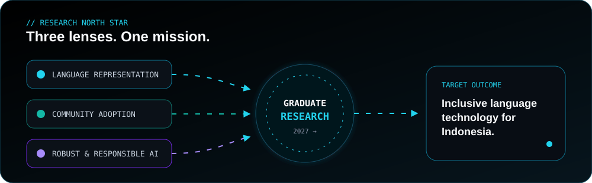
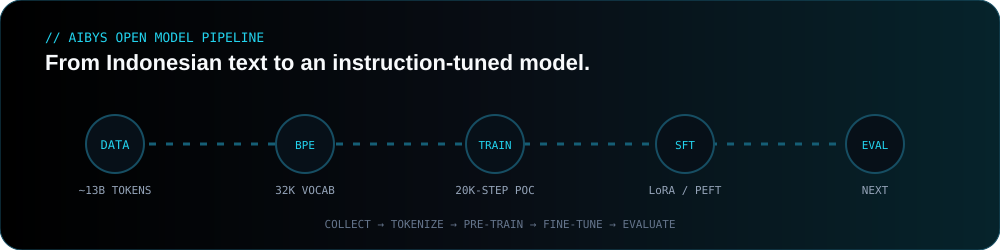

<div align="center">



[](https://git.io/typing-svg)

[](https://www.arlab.my.id)
[](https://www.linkedin.com/in/syahril-haryono/)
[](https://huggingface.co/syhrlhyn)
[](https://github.com/Arlchoose-code)

<sub><a href="#mission">MISSION</a>　·　<a href="#research">RESEARCH</a>　·　<a href="#lab">BUILD LAB</a>　·　<a href="#impact">IMPACT</a>　·　<a href="#journey">JOURNEY</a>　·　<a href="#contact">CONTACT</a></sub>

</div>

---

<a id="mission"></a>
## 01 // Graduate mission



I am taking a deliberate career break to prepare for a **fully funded Master's degree abroad**. My goal is to investigate Indonesian language technology in an academic environment where engineering, linguistics, and social context are treated as one problem—not three separate ones.

| SIGNAL | EVIDENCE |
|---|---|
| **Academic lens** | German Language Teacher Education · linguistics · pedagogy · cross-cultural communication |
| **Engineering lens** | Full-stack and backend work across Indonesia, Singapore, Italy, Belgium, and Europe |
| **Research prototype** | Open Indonesian LLM pipeline: corpus → tokenizer → pre-training → fine-tuning |
| **Social grounding** | Rural digital-literacy work and first-hand experience with technology-adoption failure |
| **Next environment** | Master's program, research lab, supervisor, scholarship, and compute collaboration |

---

<a id="research"></a>
## 02 // Research north star



### The questions I refuse to stop asking

> **Why is Bahasa Indonesia still underrepresented in the global NLP landscape—and what does it take to close that gap properly?**

Building Aibys from scratch made the representation gap tangible: data quality, tokenization, compute, evaluation, and cultural context all matter.

> **Why do communities with genuine needs still reject technology built “for” them?**

A working village platform, training for 20–50 residents, and later low adoption taught me that technical delivery is not the same as meaningful adoption. Is the barrier language, interface, culture, daily relevance—or the way we define digital readiness?

`Indonesian NLP` · `Low-resource languages` · `Computational sociolinguistics` · `Human-centered AI` · `Digital inclusion` · `Responsible AI`

---

<a id="lab"></a>
## 03 // The build lab

### Aibys · Indonesian language intelligence from scratch



| STAGE | OPEN-SOURCE EVIDENCE |
|---|---|
| **Collect** | [Aibys Data Collector](https://github.com/Arlchoose-code/Aibys-Data-Collector) · streaming preparation for 50GB+ corpora · estimated ~13B-token pipeline |
| **Tokenize** | [Aibys Tokenizer](https://huggingface.co/syhrlhyn/aibys-tokenizer) · 32K BPE vocabulary · trained on 10M sentences |
| **Pre-train** | [Indonesian LLM Starter](https://github.com/Arlchoose-code/Indonesian-LLM-Starter) · decoder-only Transformer built with PyTorch |
| **Fine-tune** | [Indonesian LLM Finetune](https://github.com/Arlchoose-code/Indonesian-LLM-Finetune) · LoRA instruction-tuning pipeline |
| **Iterate** | [Aibys2](https://github.com/Arlchoose-code/Aibys2) · checkpoints, SFT scaffolding, tool calling, and vision-data support |

<div align="center">


</div>

The full pipeline works end to end, and proof-of-concept training produced coherent Indonesian text. Full-scale training remains compute-constrained—an engineering limit that now motivates research collaboration.

### Systems shipped beyond the model

| PROJECT | WHAT IT PROVES |
|---|---|
| [Research Summarizer](https://github.com/Arlchoose-code/aibys-research-summarizer) | Research documents → structured summaries, limitations, and follow-up questions |
| [Medical Explainer](https://github.com/Arlchoose-code/aibys-medical-explainer) | Local multimodal explanation with exportable, auditable results |
| [Legal Analyzer](https://github.com/Arlchoose-code/aibys-legal-analyzer) | Contract summarization, risky-clause detection, and structured risk scoring |
| [Invoice Extractor](https://github.com/Arlchoose-code/aibys-invoice-extractor) | Vision-based extraction from PDFs and images into structured records |
| [ArLface Recognition](https://github.com/Arlchoose-code/ArLface-Recognition) | Real-time FastAPI/OpenCV system built around AuraFace embeddings |
| [Aibys AI Platform](https://github.com/Arlchoose-code/aibys-frontend) | Streaming, multi-model chat with uploads, sessions, and administration |

---

<a id="impact"></a>
## 04 // Technology in the real world

### Desa Medalsari · Karawang, 2024

Built and deployed a village digital platform, then delivered a one-week on-site digital-literacy program for **20–50 residents**. The platform's later low adoption changed how I think: a technically correct system can still be socially wrong.

### Goethe-Institut Jakarta · 2024

Guided visitors through *UNIVERSUM · MENSCH · INTELLIGENZ* at Indonesia's National Library and supported public engagement with interactive installations about AI, the universe, and human intelligence.

### The principle

> I do not want to build technology merely *for* communities. I want to understand how language, culture, trust, and participation shape technology *with* them.

---

<a id="journey"></a>
## 05 // Journey

### Education

**Universitas Negeri Jakarta · 2022–2027**  
German Language Teacher Education · linguistics · pedagogy · public speaking · cross-cultural communication

### Selected professional experience

| PERIOD | ROLE | ORGANIZATION |
|---|---|---|
| 2026 | Full Stack Web Developer | Prometheus Academy · Indonesia |
| 2026 | Full Stack Mobile Developer | RiCode · Singapore |
| 2026 | Full Stack Web Developer | IntoInc · Belgium |
| 2025–2026 | Full Stack Web Developer | Ocean Pedia · Indonesia |
| 2023–2025 | Fullstack Web Developer | Paytrizz Digital Solution · Jakarta |
| 2023–2024 | Full Stack Web Developer | EuTech LTD · Europe |
| 2023 | Full Stack Web Developer | YourData · Italy |
| 2022–2023 | Full Stack Web Developer | uPark Network · Remote |
| 2020–2021 | Back End Developer | Datasend · Singapore |
| 2018–2026 | IT Support · Self-employed | ByteDevCode · West Java |

<details>
<summary><b>Open the complete work, volunteer, and community timeline</b></summary>

- **GoStream · 2025–2026** — Full Stack Web Developer, Singapore
- **Mangaread · 2025** — Full Stack Web Developer, Indonesia
- **DPRD Kota Bogor · 2025** — Public Relations & Protocol Intern
- **Desa Medalsari · 2024** — Fullstack Web Developer, Karawang
- **Goethe-Institut Indonesien · 2024** — Event Committee and Exhibition Guide
- **Selpedia · 2019–2020** — Full Stack Web Developer, Indonesia

</details>

### Credentials


<details>
<summary><b>Open the certification portfolio</b></summary>

- **Anthropic:** Claude 101, Claude API, Claude Code, MCP introduction and advanced topics, Vertex AI, Amazon Bedrock, and AI Fluency programs.
- **Microsoft:** AI/ML foundations, algorithms, Azure AI, advanced capstone, intelligent troubleshooting agents, and full-stack capstone.
- **IBM:** Machine Learning with Python, Python for Data Science and AI, Full Stack assessment, HTML/CSS/JavaScript.
- **Google Cloud:** Core Infrastructure, REST APIs with Go and Cloud Run, Document AI with Python.
- **Meta, Amazon, Duke, Santri Koding, and others:** version control, JavaScript, frontend, generative AI, Rust, Go, Laravel, React, Vue, Nuxt, Flutter, Bun, and Hono.

Verification details are available on [LinkedIn](https://www.linkedin.com/in/syahril-haryono/).

</details>

---

## 06 // Toolkit

<div align="center">

[](https://skillicons.dev)

[](https://git.io/typing-svg)

</div>

| HUMAN LANGUAGE | PROFICIENCY |
|---|---|
| 🇮🇩 Bahasa Indonesia | Native |
| 🇬🇧 English | Professional working proficiency |
| 🇩🇪 Deutsch | B2 · 3+ years of academic study and Goethe-Institut experience |

---

## 07 // Open-source telemetry

<div align="center">


### Pac-Man contribution run

<!-- ?v=2 refreshes GitHub Camo after the action creates the file. -->


### Contribution snake


</div>

---

## 08 // Origin story

<details>
<summary><b>From breaking systems to researching language systems</b></summary>

```text
2014  Curiosity began at the edges of systems: vulnerabilities, networks,
      failure modes, and how the machinery underneath actually worked.
        │
2018  Curiosity became construction. ByteDevCode and real users replaced
      experiments without a destination.
        │
2022  German-language education introduced a second lens: meaning,
      pedagogy, culture, and how communication succeeds—or breaks.
        │
2024  Goethe-Institut and Desa Medalsari connected technology with people.
      A platform worked technically but failed to sustain adoption.
        │
2025  Aibys began: Indonesian data, a tokenizer, a Transformer stack,
      proof-of-concept training, and a question larger than the code.
        │
2026  The ecosystem became public. I paused professional work to fight
      for the scholarship and research environment needed for the next step.
        │
NEXT  Turn accumulated questions into rigorous graduate research—and
      return the knowledge to the communities that shaped those questions.
```

</details>

> “I learned how systems break before I learned how to build them. That is not a detour—it is the foundation.”

---

<a id="contact"></a>
<div align="center">

## Research. Collaborate. Build.

I am open to **prospective supervisors, scholarship communities, research labs, open-source collaborators, and compute partners** working on inclusive language technology.

[](https://www.linkedin.com/in/syahril-haryono/)
[](https://www.arlab.my.id)


</div>
